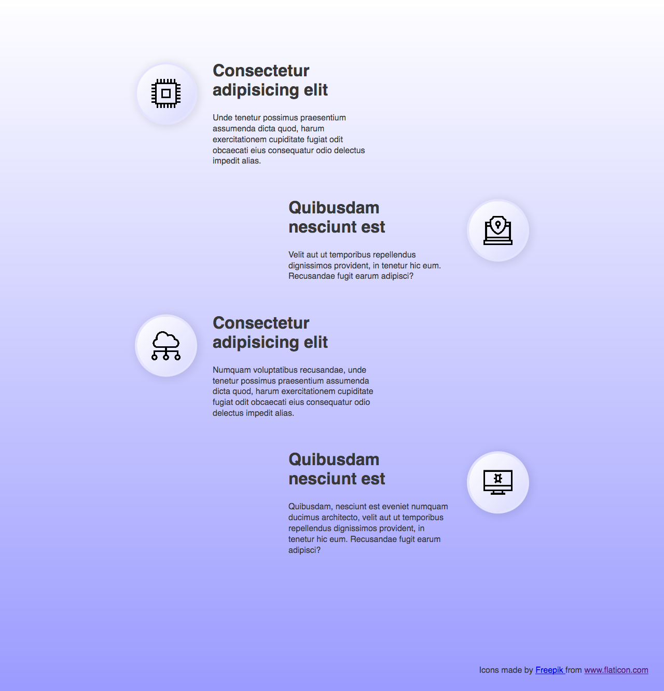
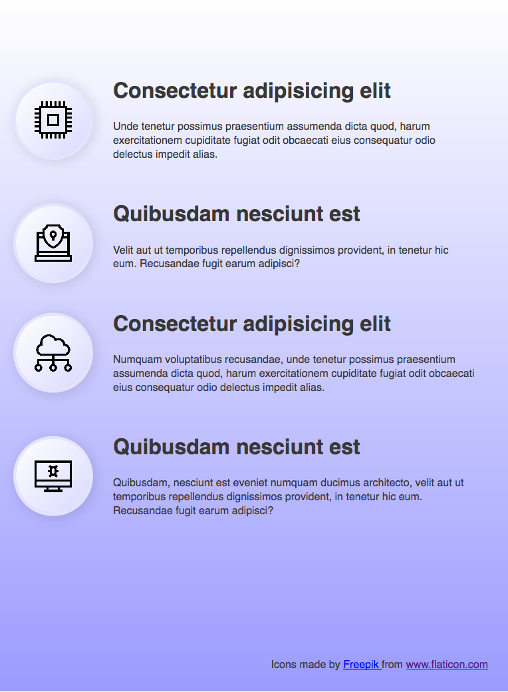
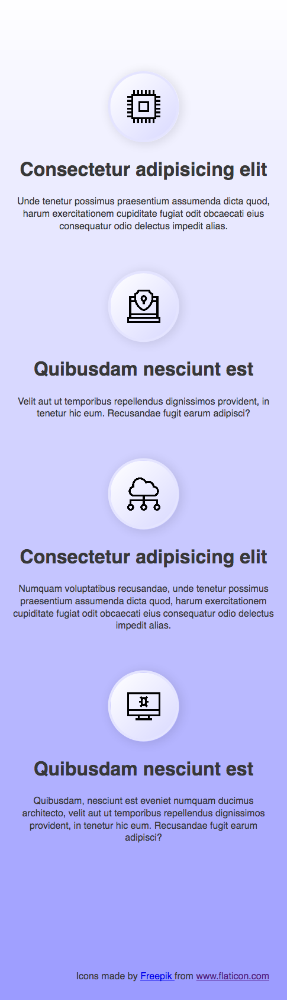

# KPI list

## Desktop

- [x] the list is centered on the screen
- [x] icons are placed on each side of the item



## Tablet

- [x] all items are displayed one below the other
- [x] all icons are on the same side

Take a look at the example:



## Mobile

- [x] content is centered



## Icons attribution

```html
<p>
  Icons made by
  <a href="https://www.flaticon.com/authors/freepik" title="Freepik">
    Freepik
  </a>
  from
  <a href="https://www.flaticon.com/" title="Flaticon">
    www.flaticon.com
  </a>
</p>
```
